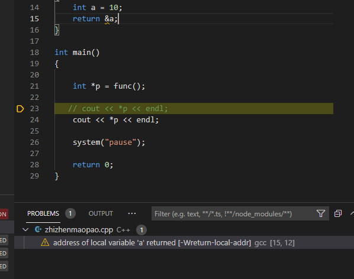
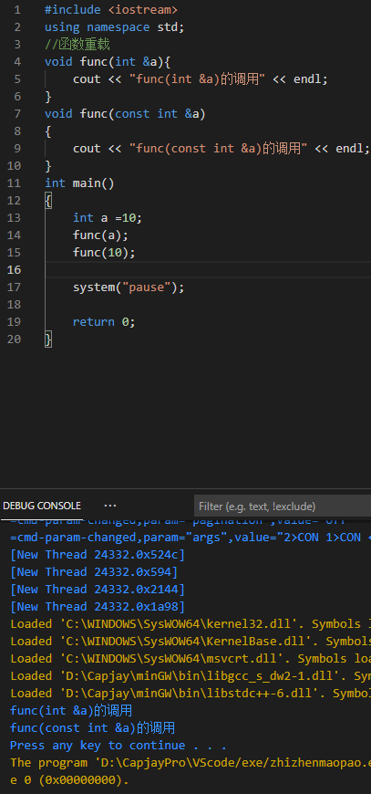
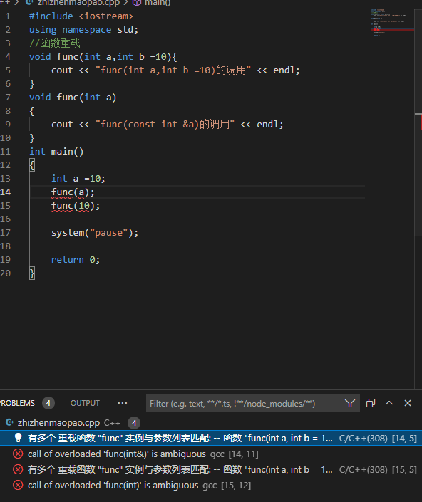
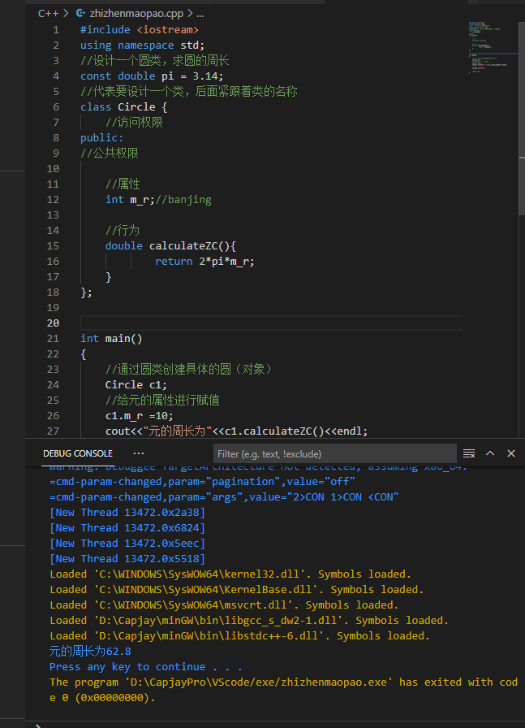
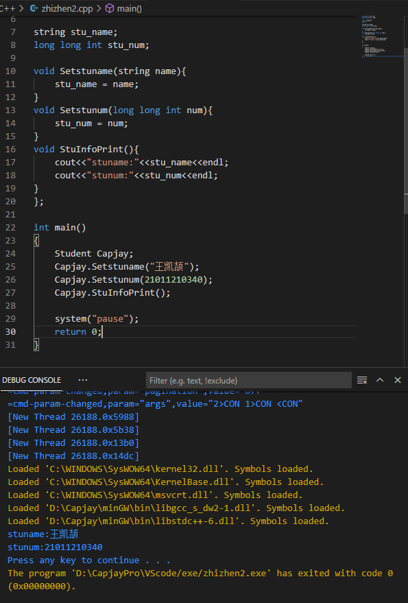
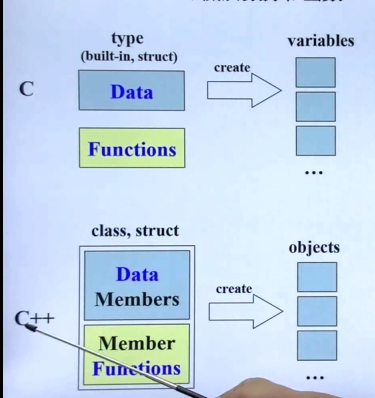

# C++学习记录

## C++基础

### 第一个C++程序

创建项目

创建文件

编写代码

运行程序

#### 创建项目

#### 创建文件

#### 编写代码

```c++
#include<iostream>

using namespace std;

int main()

{

cout<<"hello world"<<endl;

system("pause");

return 0;

}
```


#### 运行程序


```c++

```

### 注释

作用：可以方便阅读

格式(放在代码上方)

1单行注释

```c++
//描述信息
```

2多行注释

```C++
/*描述信息*/
```


```C++
#include<iostream>

using namespace std;
/*main函数是每个程序的入口
且唯一
*/
int main()
{
//在屏幕中输出Hello World
cout<<"hello world"<<end1;

system("pause");

return 0;

}
```

### 变量

作用：给一段指定的内存空间起名，方便操作这段内存

语法：数据类型 变量名 = 变量初始值

```C++
int a = 10;
```

```C++
#include<iostream>

using namespace std;
/*main函数是每个程序的入口
且唯一
*/
int main()
{
int a = 10;
cout<<"a="<<a<<end1;

system("pause");

return 0;

}
```

### 常量

作用：不可更改的数据

两种方式

1 #define 宏常量  （通常在文件上方定义）

#define 常量名 常量值

2 const 修饰的变量（通常在变量定义前加关键字const）

const 数据类型 常量名 = 常量值


### 关键字

作用：C++中预先保留的单词（标识符）不要定义


### 标识符命名规则

作用：给变量命名的规则

1 只有是字母数字下划线

2 第一个字符不能是数字

3 不能是关键字

4 区分大小写

## 数据类型

给变量分配合适的内存空间

### 整形

作用：表示整数类型

| 数据类型  | 占用空间                                    |
| :-------: | :------------------------------------------ |
|   short   | 2Byte    16位    -2^15~2^15-1  -32768~32767 |
|    int    | 4Byte    32位                               |
|   long    | Win是4Byte                                  |
| long long | 8Byte                                       |

### sizeof

作用：看数据类型所占大小

语法：

```C++
sizeof(数据类型/变量)
```


### 实型（浮点型）

作用：表示小数

分类：1 单精度float  4Byte

​				小数后面加f

​			2双精度double  8Byte

**科学计数法**

e代表*10^

### 字符型

作用：表示单个字符（字母）

语法：注意是单引号,单引号内只能有一个字符

```C++
char ch = 'a';
```


a-97

A-65

### 转义字符

作用：表示不能显示出来的ASCII


\n 等于C++中的<<endl的作用（换行）

\\ \  反斜杠必须得打两个才能输出一个反斜杠\

\t 输出时可以对齐后面的输出内容

### 

### 字符串型

作用：表示一串字符

两种：

1 C 

​	char 变量名**[ ]** = **"**字符串值**"**；

2 C++

​	string 变量名 =  **“**字符串值**”**；


### 布尔类型 bool

作用：真/假

值：true-真（1）

​		false-假（2）


### 数据的输入

作用：从键盘上获取数据

关键字：cin

语法：cin>>变量


**在给string赋值的时候要添加头文件#include<string>**


## 运算符

作用：执行代码的运算

### 算术运算符

作用：用于处理四则运算

| 运算符 | 术语         | 示例       | 结果     |
| ------ | ------------ | ---------- | -------- |
| +      | 正号         | +3         | 3        |
| -      | 符号         | -3         | -3       |
| +      | 加           | 1+2        | 3        |
| -      | 减           | 2-1        | 1        |
| *      | 乘           | 2*3        | 6        |
| /      | 除           | 4/2        | 2        |
| %      | 取模（取余） | 4%3        | 1        |
| ++     | 前置递增     | a=2;b=++a; | a=3;b=3; |
| ++     | 后置递增     | a=2;b=a++; | a=3;b=2; |
| --     | 前置递减     | a=2;b=--a; | a=1;b=1; |
| --     | 后置递减     | a=2;b=a--; | a=1;b=2; |


**注意**：0不能作为除数，同样不能用来取模（右边）

​			两个小数之间不能做取模运算

​			( )内优先运算


### 赋值运算符

| 运算符 | 术语   | 示例      | 结果 |
| ------ | ------ | --------- | ---- |
| =      | 等于   | a=2;      | a=2; |
| +=     | 加等于 | a=0;a+=2; | a=2; |
| -=     | 减等于 | a=2;a-=1; | a=1; |
| *=     | 乘等于 | a=2;a*=3; | a=6; |
| /=     | 除等于 | a=4;a/=2; | a=2; |
| %=     | 模等于 | a=3;a%=2; | a=1; |


### 比较运算符

作用：比较后返回真值或者假值

| 运算符 | 术语     | 示例 | 结果 |
| ------ | -------- | ---- | ---- |
| ==     | 相等于   | 1==2 | 0    |
| !=     | 不等于   | 1!=2 | 1    |
| <      | 小于     | 1<2  | 1    |
| >      | 大于     | 1>2  | 0    |
| <=     | 小于等于 | 1<=2 | 1    |
| >=     | 大于等于 | 1>=2 | 0    |

### 逻辑运算符

作用：根据表达式的值返回真值或假值

| 运算符 | 术语 | 示例   | 结果                 |
| ------ | ---- | ------ | -------------------- |
| ！     | 非   | !a     | 与a相反              |
| &&     | 与   | a&&b   | ab都为真为1，否则为0 |
| \|\|   | 或   | a\|\|b | ab都为假为0，否则为1 |


## 程序流程结构

**顺序结构：**程序按顺序执行，不发生跳转	

**选择结构：**依据条件是否满足，有选择地执行相应功能

**循环结构：**依据条件是否满足，循环多次执行某段代码

### 选择结构

#### if

作用：执行满足条件的语句

​    单行格式if语句	

只有if没有else

​	多行格式if语句

if...else...


​		多条件的if语句


**嵌套if**

if中再写if


#### 三目运算

作用：实现简单判断

语法：表达式1 ？ 表达式2：表达式3

解释：表达式1为真，执行表达式2，并返回表达式2的结果；

​			表达式1为假，执行表达式3，并返回表达式3的结果。


**注意**

（ ）的返回值为变量  可以继续赋值  如截图中第二次返回B赋值为100

#### switch

作用：执行多条件分支语句

语法：

```C++
switch(表达式){
    case 结果1:执行语句;break;
    case 结果2:执行语句;break;
        ...
    default:执行语句;break;
}
```


**缺点**

判断的时候只能是整形或者是字符型，不能是一个区间

**注意**

如果case里面没有break，程序会一直往下走


### 循环结构

#### while

作用：满足循环条件，执行循环语句

语法：`while（循环条件）{循环语句}`

解释：只要循环条件为真，即执行循环语句


**注意**

while(1)是一个死循环 

**猜数字小游戏**


（这游戏随机数一直是42，是伪随机数，需要添加随机种子。。。。）


添加随机种子之后，注意随机种子要引入#include<ctime>

#### do...while

左右：满足循环条件，执行循环语句

语法：do{循环语句}while（循环条件）；

**注意**：与while不同，do...while会先执行一次循环语句，在判断循环条件


**案例**

水仙花案例

三位数每个位的数的立方和等于本身


**注意**：判断条件不要写成=  是 ==


#### for

作用：满足循环条件循环

语法：for(起始表达式；条件表达式；末尾循环体){ 循环语句；}


**注意：**`for( ; ; )`是死循环

**案例**

敲桌子（7）


#### 嵌套循环

作用在循环里面再写循环


**案例**

乘法口诀表


### 跳转语句

#### break

作用：跳出选择结构或者是循环结构

使用：

switch

循环语句

嵌套循环（会跳出最近的循环，循环里面有选择会跳出循环）

#### continue

作用：在循环语句中，跳过本次循环中余下尚未执行的语句，继续执行下一次循环

#### goto

作用：无条件跳转到标记

语法：`goto 标记;`  `标记：`

基本不用 虽然很强大 但是因为一直找跳转FLAG位置 可读性差  逻辑结构差


## 数组

数组就是一个集合，存放相同类型的数据元素

特点： 数组中数据元素的类型相同；元素的内存位置连续；

## 函数

函数的定义一般主要有5个步骤：

1、返回值类型

2、函数名

3、参数表列

4、函数体语句

5、return 表达式

### 值传递

值传递的时候形参发生变化不会影响实参。

### 函数的声明

**作用：** 告诉编译器函数名称及如何调用函数。函数的实际主体可以单独定义。

- 函数的**声明可以多次**，但是函数的**定义只能有一次**

### 函数分文件编写

**作用：**让代码结构更加清晰

函数分文件编写一般有4个步骤

1. 创建后缀名为.h的头文件
2. 创建后缀名为.cpp的源文件
3. 在头文件中写函数的声明
4. 在源文件中写函数的定义

## 指针

### 基本概念

可以通过指针间接访问内存

- 内存编号是从0开始记录的，一般用十六进制数字表示
- 可以利用指针变量保存地址

### 指针变量的定义和使用

```C++
数据类型 *变量名；
```

```C++
int main() {

	//1、指针的定义
	int a = 10; //定义整型变量a
	
	//指针定义语法： 数据类型 * 变量名 ;
	int * p;

	//指针变量赋值
	p = &a; //指针指向变量a的地址
	cout << &a << endl; //打印数据a的地址
	cout << p << endl;  //打印指针变量p

	//2、指针的使用
	//通过*操作指针变量指向的内存
	cout << "*p = " << *p << endl;

	system("pause");

	return 0;
}
```

指针变量和普通变量的区别

- 普通变量存放的是数据,指针变量存放的是地址
- 指针变量可以通过" * "操作符，操作指针变量指向的内存空间，这个过程称为解引用

1.可以通过&获取变量的地址

2.可以利用指针记录地址

3.可以对指针变量解引用，操作指针指向的内存

### 指针占用的内存空间

32位操作系统下是四个字节

### 空指针和野指针

**空指针**：指针变量指向内存中编号为0的空间

**用途：**初始化指针变量

**注意：**空指针指向的内存是不可以访问的

```C++
int main() {

	//指针变量p指向内存地址编号为0的空间
	int * p = NULL;

	//访问空指针报错 
	//内存编号0 ~255为系统占用内存，不允许用户访问
	cout << *p << endl;

	system("pause");

	return 0;
}

```

**野指针**：指针变量指向非法的内存空间

```c++
int main() {

	//指针变量p指向内存地址编号为0x1100的空间
	int * p = (int *)0x1100;

	//访问野指针报错 
	cout << *p << endl;

	system("pause");

	return 0;
}
```

空指针和野指针都不是我们申请的空间，因此不要访问。

### const修饰指针

const修饰指针有三种情况

1. const修饰指针 — 常量指针
2. const修饰常量 — 指针常量
3. const即修饰指针，又修饰常量

```c++
int main() {

	int a = 10;
	int b = 10;

	//const修饰的是指针，指针指向可以改，指针指向的值不可以更改
	const int * p1 = &a; 
	p1 = &b; //正确
	//*p1 = 100;  报错
	

	//const修饰的是常量，指针指向不可以改，指针指向的值可以更改
	int * const p2 = &a;
	//p2 = &b; //错误
	*p2 = 100; //正确

    //const既修饰指针又修饰常量
	const int * const p3 = &a;
	//p3 = &b; //错误
	//*p3 = 100; //错误

	system("pause");

	return 0;
}

```

### 指针和数组

**作用：**利用指针访问数组中元素

```c++
int main() {

	int arr[] = { 1,2,3,4,5,6,7,8,9,10 };

	int * p = arr;  //指向数组的指针

	cout << "第一个元素： " << arr[0] << endl;
	cout << "指针访问第一个元素： " << *p << endl;

	for (int i = 0; i < 10; i++)
	{
		//利用指针遍历数组
		cout << *p << endl;
		p++;
	}

	system("pause");

	return 0;
}
```

### 指针和函数

**作用：**利用指针做函数参数，可以**修改实参的值**。

```C++
//值传递
void swap1(int a ,int b)
{
	int temp = a;
	a = b; 
	b = temp;
}
//地址传递
void swap2(int * p1, int *p2)
{
	int temp = *p1;
	*p1 = *p2;
	*p2 = temp;
}

int main() {

	int a = 10;
	int b = 20;
	swap1(a, b); // 值传递不会改变实参

	swap2(&a, &b); //地址传递会改变实参

	cout << "a = " << a << endl;

	cout << "b = " << b << endl;

	system("pause");

	return 0;
}
```

<!--总结：如果不想修改实参，就用值传递，如果想修改实参，就用地址传递-->

### 指针、数组、函数

**案例描述：**封装一个函数，利用冒泡排序，实现对整型数组的升序排序

例如数组：int arr[10] = { 4,3,6,9,1,2,10,8,7,5 };

```C++
#include <iostream>
using namespace std;

void swap(int *a, int *b)
{
    if (*a > *b)
    {
        int temp = *a;
        *a = *b;
        *b = temp;
    }
}

int main()
{
    int arr[10] = {4, 3, 6, 9, 1, 2, 10, 8, 7, 5};
    for (int i = 0; i < 10; i++)
    {
        for (int j = 0; j <10-i;j++){
            swap(&arr[j],&arr[j+1]);
        }
    }
    for(int i =0;i<10;i++){
        cout<<arr[i]<<" ";
    }
    system("pause");
    return 0;
}
```

## 结构体

### 基本概念

结构体属于用户自定义的数据类型，允许用户存储不同的数据类型。

### 结构体定义和使用

**语法**：struct 结构体名 {结构体成员列表}；

通过结构体创建变量的方式有三种：

- struct 结构体名 变量名
- struct 结构体名 变量名 = { 成员1值 ， 成员2值…}
- 定义结构体时顺便创建变量

```c++
//结构体定义
struct student
{
	//成员列表
	string name;  //姓名
	int age;      //年龄
	int score;    //分数
}stu3; //结构体变量创建方式3 


int main() {

	//结构体变量创建方式1
	struct student stu1; //struct 关键字可以省略

	stu1.name = "张三";
	stu1.age = 18;
	stu1.score = 100;
	
	cout << "姓名：" << stu1.name << " 年龄：" << stu1.age  << " 分数：" << stu1.score << endl;

	//结构体变量创建方式2
	struct student stu2 = { "李四",19,60 };

	cout << "姓名：" << stu2.name << " 年龄：" << stu2.age  << " 分数：" << stu2.score << endl;


	stu3.name = "王五";
	stu3.age = 18;
	stu3.score = 80;
	

	cout << "姓名：" << stu3.name << " 年龄：" << stu3.age  << " 分数：" << stu3.score << endl;

	system("pause");

	return 0;
}

```

> 总结1：定义结构体时的关键字是struct，不可省略

> 总结2：创建结构体变量时，关键字struct可以省略

> 总结3：结构体变量利用操作符 ‘’.’’ 访问成员

### 结构体数组

**作用：**将自定义的结构体放入到数组中方便维护

**语法：**`struct 结构体名 数组名[元素个数] = {{},{},...}`

```c++
//结构体定义
struct student
{
	//成员列表
	string name;  //姓名
	int age;      //年龄
	int score;    //分数
}

int main() {
	
	//结构体数组
	struct student arr[3]=
	{
		{"张三",18,80 },
		{"李四",19,60 },
		{"王五",20,70 }
	};

	for (int i = 0; i < 3; i++)
	{
		cout << "姓名：" << arr[i].name << " 年龄：" << arr[i].age << " 分数：" << arr[i].score << endl;
	}

	system("pause");

	return 0;
}
```

### 结构体指针

**作用：**通过指针访问结构体中的成员

- 利用操作符 `->`可以通过结构体指针访问结构体属性

```C++
//结构体定义
struct student
{
	//成员列表
	string name;  //姓名
	int age;      //年龄
	int score;    //分数
};


int main() {
	
	struct student stu = { "张三",18,100, };
	
	struct student * p = &stu;
	
	p->score = 80; //指针通过 -> 操作符可以访问成员

	cout << "姓名：" << p->name << " 年龄：" << p->age << " 分数：" << p->score << endl;
	
	system("pause");

	return 0;
}

```

总结：结构体**指针可以通过 ->** 操作符 来访问结构体中的成员

### 结构体嵌套结构体

**作用：** 结构体中的成员可以是另一个结构体

**例如：**每个老师辅导一个学员，一个老师的结构体中，记录一个学生的结构体

```c++
//学生结构体定义
struct student
{
	//成员列表
	string name;  //姓名
	int age;      //年龄
	int score;    //分数
};

//教师结构体定义
struct teacher
{
    //成员列表
	int id; //职工编号
	string name;  //教师姓名
	int age;   //教师年龄
	struct student stu; //子结构体 学生
};


int main() {

	struct teacher t1;
	t1.id = 10000;
	t1.name = "老王";
	t1.age = 40;

	t1.stu.name = "张三";
	t1.stu.age = 18;
	t1.stu.score = 100;

	cout << "教师 职工编号： " << t1.id << " 姓名： " << t1.name << " 年龄： " << t1.age << endl;
	
	cout << "辅导学员 姓名： " << t1.stu.name << " 年龄：" << t1.stu.age << " 考试分数： " << t1.stu.score << endl;

	system("pause");

	return 0;
}
```

### 结构体作为函数输入

**作用：**将结构体作为参数向函数中传递

传递方式有两种：

- 值传递
- 地址传递

```C++
#include <iostream>
using namespace std;
struct student{
    string name;
    int age;
    int score;

};
void printinfo(student stu){
    stu.name = "Capjay";
    cout<<"stumane = "<<stu.name<<endl;
}
void printinfo2(student *stu){
    stu->name = "Capjay";
    cout<<"stuname = "<<stu->name<<endl;
}

int main()
{
    student stu;
    printinfo(stu);
    cout<<"值 "<<stu.name<<endl;
    printinfo2(&stu);
    cout<<"指针 "<<stu.name<<endl;

    system("pause");
    return 0;
}
```

总结：如果不想修改主函数中的数据，用值传递，反之用地址传递

### 结构体中const使用场景

**作用：**用const来防止误操作

```c++
//学生结构体定义
struct student
{
	//成员列表
	string name;  //姓名
	int age;      //年龄
	int score;    //分数
};

//const使用场景
void printStudent(const student *stu) //加const防止函数体中的误操作
{
	//stu->age = 100; //操作失败，因为加了const修饰
	cout << "姓名：" << stu->name << " 年龄：" << stu->age << " 分数：" << stu->score << endl;

}

int main() {

	student stu = { "张三",18,100 };

	printStudent(&stu);

	system("pause");

	return 0;
}
```

### 案例

**案例描述：**

设计一个英雄的结构体，包括成员姓名，年龄，性别;创建结构体数组，数组中存放5名英雄。

通过冒泡排序的算法，将数组中的英雄按照年龄进行升序排序，最终打印排序后的结果。

五名英雄信息如下：

```c++
		{"刘备",23,"男"},
		{"关羽",22,"男"},
		{"张飞",20,"男"},
		{"赵云",21,"男"},
		{"貂蝉",19,"女"},
```

```c++
#include <iostream>
using namespace std;
struct hero{
    string name;
    int age;
    string sex;

};
void swap(hero *hero1,hero *hero2){
    if(hero1->age>hero2->age){
        hero temp = *hero1;
        *hero1 = *hero2;
        *hero2 = temp;
    }
}
int main()
{
    hero heros[5];
    heros[0] = {"刘备",23,"男"};
    heros[1] = {"关羽",22,"男"};
    heros[2] = {"张飞",20,"男"};
    heros[3] = {"赵云",21,"男"};
    heros[4] = {"貂蝉",19,"女"};
    for(int i =0;i<5;i++){
        for(int j=0;j<5-i;j++){
            swap(&heros[j],&heros[j+1]);
        }
    }
    for(int r =0;r<5;r++){
        cout<<heros[r].name<<" ";
        cout<<heros[r].age<<" ";
        cout<<heros[r].sex<<",";
    }
    system("pause");
    return 0;
}
```

# C++核心编程（面向对象）

## 内存分区模式

C++程序在执行的时候，将内存大方向划分为4个区域

- 代码区：存放函数体的二进制代码，由操作系统进行管理
- 全局区：存放全局变量喝静态变量以及常量
- 栈区：由编译器自动分配释放，存放函数的参数值，局部变量等
- 堆区：由程序员分配喝释放，如果程序员不释放，程序结束时由操作系统回收

**意义**：不同区域存放的数据，赋予不同的生命周期，给我们更大的灵活编程

### 程序运行前

在程序编译之后，生成了exe可执行程序，未执行该程序前分为两个区域。

**代码区**：

存放CPU执行的机器指令

代码区是<u>共享</u>的，共享的目的是对于频繁被执行的程序，只需要在内存中有一份代码即可

代码区是<u>只读</u>的，使其只读的原因是防止程序意外的修改了它的指令

**全局区**：

全局变量和静态变量存放在此

全局区还包括了常量区，字符串常量和其他常量也存放在此

该区域的数据在程序结束后由操作系统释放

总结：

- C++中在程序运行前分为全局区和代码区
- 代码区特点是共享和只读
- 全局区中存放全局变量、静态变量、常量
- 常量区中存放 const修饰的全局常量 和 字符串常量

### 程序运行后

**栈区**：

由编译器自动分配释放，存放函数的参数值，局部变量等

 注意事项：不要返回<u>局部变量的地址</u>，栈区开辟的数据由编译器自动释放



**堆区**：

由程序员分配释放，若程序员不释放，程序结束时由操作系统回收

在C++中主要利用new在堆区开辟内存

### new操作符

C++中利用new操作符在堆区开辟数据

堆区开辟的数据由程序员手动开辟，手动释放，释放利用操作符delete

语法：`new 数据类型​`

利用new创建的数据，会返回该数据对应的类型的指针

**预备知识**
    代码中定义的普通变量，会在栈区分配一个对应大小的内存空间，栈区的存储空间小；
    代码中定义的动态变量则是在堆区，堆区的存储空间相比于栈区大很多；

**为什么需要动态内存**

- 相比与定义一个普通变量，定义一个动态变量能使用的内存空间更大，当你的某个变量有很多的存储需求时，动态分配内存能满足你的需求

- 当你需要定义的某个变量的大小是可变的且范围较大，这个时候你定义一个普通变量，会分配一个固定大小的内存，当需要存入的数据较小的时候，大量的内存空间被浪费了，数据较大时容易溢出，你为了防止内存溢出还不得不给这个变量足够大的内存，若只有少数几个这样的变量，也只是内存浪费，但是对于大型项目，可能会存在很多这样的变量，这个时候栈区就可能被撑爆掉(栈区很小嘛)；这个时候，动态内存分配就闪亮登场了，反正很有钱(堆区空间大嘛)，为了保证出去玩钱够用(防止内存溢出)，可以往银行卡里打入足够的钱(预分配足够的内存空间)，需要花多少钱就用多少钱（变量有多大就用多大的内存，不怕内存浪费，因为：动态！可大可小！）

- 动态内存的分配是用指针实现的，定义动态内存实际上是定义了一个指针，该指针指向了某一块内存空间，传递指针比传递整个变量更加高效

- 当在一个函数/块中动态分配一个内存，当函数/块结束后它并不会被释放，仍然需要手动释放内存，而在栈区定义的普通变量在函数/块结束后会自动释放内存，这里也说明了动态定义的变量的生存期是要比普通变量长的，且生存期的长短可以由你来控制

  ```C++
  #include <iostream>
  using namespace std;
  
  int *func()
  {
      int *a = new int(10);
      return a;
  }
  
  int main()
  {
  
      int *p = func();
  
      cout << *p << endl;
      cout << *p << endl;
  
      //利用delete释放堆区数据
      delete p;
  
      //cout << *p << endl; //报错，释放的空间不可访问
  
      system("pause");
  
      return 0;
  }
  ```

  ```C++
  //堆区开辟数组
  int main() {
  
  	int* arr = new int[10];
  
  	for (int i = 0; i < 10; i++)
  	{
  		arr[i] = i + 100;
  	}
  
  	for (int i = 0; i < 10; i++)
  	{
  		cout << arr[i] << endl;
  	}
  	//释放数组 delete 后加 []
  	delete[] arr;
  
  	system("pause");
  
  	return 0;
  }
  ```

## 引用

### 引用的基本使用

**作用**：给变量起名字

语法：`数据类型 &别名 = 原名`

示例

```C++
int main() {

	int a = 10;
	int &b = a;

	cout << "a = " << a << endl;
	cout << "b = " << b << endl;

	b = 100;

	cout << "a = " << a << endl;
	cout << "b = " << b << endl;

	system("pause");

	return 0;
}
```

### 引用注意事项

- 引用必须初始化
- 引用在初始化后不可以改变

```C++
int main() {

	int a = 10;
	int b = 20;
	//int &c; //错误，引用必须初始化
	int &c = a; //一旦初始化后，就不可以更改
	c = b; //这是赋值操作，不是更改引用

	cout << "a = " << a << endl;
	cout << "b = " << b << endl;
	cout << "c = " << c << endl;

	system("pause");

	return 0;
}
```

### 引用做函数参数

**作用：**函数传参时，可以利用引用的技术让形参修饰实参

**优点：**可以简化指针修改实参

```C++
//1. 值传递
void mySwap01(int a, int b) {
	int temp = a;
	a = b;
	b = temp;
}

//2. 地址传递
void mySwap02(int* a, int* b) {
	int temp = *a;
	*a = *b;
	*b = temp;
}

//3. 引用传递
void mySwap03(int& a, int& b) {
	int temp = a;
	a = b;
	b = temp;
}

int main() {

	int a = 10;
	int b = 20;

	mySwap01(a, b);
	cout << "a:" << a << " b:" << b << endl;

	mySwap02(&a, &b);
	cout << "a:" << a << " b:" << b << endl;

	mySwap03(a, b);
	cout << "a:" << a << " b:" << b << endl;

	system("pause");

	return 0;
}
```

总结：通过引用参数产生的效果同按地址传递是一样的。引用的语法更清楚简单

### 引用做函数返回值

作用：引用是可以作为函数的返回值存在的

注意：**不要返回局部变量引用**

用法：函数调用作为左值

```C++
//返回局部变量引用
int& test01() {
	int a = 10; //局部变量
	return a;
}

//返回静态变量引用
int& test02() {
	static int a = 20;
	return a;
}

int main() {

	//不能返回局部变量的引用
	int& ref = test01();
	cout << "ref = " << ref << endl;
	cout << "ref = " << ref << endl;

	//如果函数做左值，那么必须返回引用
	int& ref2 = test02();
	cout << "ref2 = " << ref2 << endl;
	cout << "ref2 = " << ref2 << endl;

	test02() = 1000;

	cout << "ref2 = " << ref2 << endl;
	cout << "ref2 = " << ref2 << endl;

	system("pause");

	return 0;
}
```

### 引用的本质

**本质：**引用的本质在C++内部实现是一个指针常量。

```C++
//发现是引用，转换为 int* const ref = &a;
void func(int& ref){
	ref = 100; // ref是引用，转换为*ref = 100
}
int main(){
	int a = 10;
    
    //自动转换为 int* const ref = &a; 指针常量是指针指向不可改，也说明为什么引用不可更改
	int& ref = a; 
	ref = 20; //内部发现ref是引用，自动帮我们转换为: *ref = 20;
    
	cout << "a:" << a << endl;
	cout << "ref:" << ref << endl;
    
	func(a);
	return 0;
}
```

结论：C++推荐用引用技术，因为语法方便，引用本质是指针常量，但是所有的指针操作编译器都帮我们做了

### 常量的引用

**作用：**常量引用主要用来修饰形参，防止误操作

在函数形参列表中，可以加const修饰形参，防止形参改变实参

```C++
//引用使用的场景，通常用来修饰形参
void showValue(const int& v) {
	//v += 10;
	cout << v << endl;
}

int main() {

	//int& ref = 10;  引用本身需要一个合法的内存空间，因此这行错误
	//加入const就可以了，编译器优化代码，int temp = 10; const int& ref = temp;
	const int& ref = 10;

	//ref = 100;  //加入const后不可以修改变量
	cout << ref << endl;

	//函数中利用常量引用防止误操作修改实参
	int a = 10;
	showValue(a);

	system("pause");

	return 0;
}
```

## 函数提高

#### 函数默认参数

语法：返回值类型 函数名 （参数= 默认值）{}

（可以给默认值，但是如果某个位置有个默认参数，那么从这个参数从左往右，都得有默认值）

如果函数的声明有了默认参数，那么函数的实现（定义）就不能有默认参数了，所以函数声明和实现只能有一个默认参数。（二义性）

```C++
#include <iostream>
using namespace std;
int func(int a = 10 ,int b = 10, int c = 10);
int func(int a,int b,int c){
    return a+b+c;
}

int main()
{
    
    cout<<func(100,20)<<endl;

    system("pause");

    return 0;
}
```

#### 函数占位参数

C++中函数的形参列表里面可以有占位参数，用来做占位，调用函数的时候必须填补该位置。

占位参数可以有默认参数，调用的时候就可以不用传了。

**语法：** `返回值类型 函数名 (数据类型){}`

```C++
#include <iostream>
using namespace std;
//占位参数
void func(int a,int){
    cout<<"this is func"<<endl;
}
int main()
{
    func(10,10);


    system("pause");

    return 0;
}
```

#### 函数重载

**作用：**函数名可以相同，提高复用性

**函数重载满足条件：**

- 同一个作用域下
- 函数名称相同
- 函数参数**类型不同** 或者 **个数不同** 或者 **顺序不同**

**注意:** 函数的返回值不可以作为函数重载的条件（因为不知道调用谁）

```C++
#include <iostream>
using namespace std;
//函数重载
void func(){
    cout<<"fnc的调用"<<endl;
}
void func(int a){
    cout<<"func的调用"<<endl;
}
int main()
{
    
    func();

    system("pause");

    return 0;
}
```

**函数重载的注意事项**：

- 引用作为重载条件
- 函数重载碰到函数默认参数（会有二义性）


```C++
#include <iostream>
using namespace std;
//函数重载
void func(int &a){
    cout << "func(int &a)的调用" << endl;
}
void func(const int &a)
{
    cout << "func(const int &a)的调用" << endl;
}
int main()
{
    int a =10;
    func(a);
    func(10);

    system("pause");

    return 0;
}
```




```C++
#include <iostream>
using namespace std;
//函数重载
void func(int a,int b =10){
    cout << "func(int a,int b =10)的调用" << endl;
}
void func(int a)
{
    cout << "func(const int &a)的调用" << endl;
}
int main()
{
    int a =10;
    func(a);
    func(10);

    system("pause");

    return 0;
}
```



## 类和对象

C++面向对象的三大特征为：==封装、继承、多态==

C++认为万事万物都皆为对象，对象上有其属性和行为

###  封装

#### 封装的意义

封装是C++面向对象的三大特征之一

**封装的意义：**

- 将属性和行为作为一个整体，表现生活中的事务
- 将属性和行为加以权限控制

封装意义一：

​	在设计类的时候，属性和行为写在一起，表现事物

**语法：** `class 类名{ 访问权限： 属性 / 行为 };`

示例1

```C++
#include <iostream>
using namespace std;
//设计一个圆类，求圆的周长
const double pi = 3.14;
//代表要设计一个类，后面紧跟着类的名称
class Circle {
    //访问权限
public:
//公共权限

    //属性
    int m_r;//banjing

    //行为
    double calculateZC(){
            return 2*pi*m_r;
    }
};


int main()
{
    //通过圆类创建具体的圆（对象）实例化
    Circle c1;
    //给元的属性进行赋值
    c1.m_r =10;
    cout<<"元的周长为"<<c1.calculateZC()<<endl;

    system("pause");

    return 0;
}
```



示例2：设计一个学生类，属性有姓名和学号，可以给姓名和学号赋值，可以显示学生的姓名和学号

```C++
#include <iostream>
using namespace std;

class Student{
public:

string stu_name;
long long int stu_num;

void Setstuname(string name){
    stu_name = name;
}
void Setstunum(long long int num){
    stu_num = num;
}
void StuInfoPrint(){
    cout<<"stuname:"<<stu_name<<endl;
    cout<<"stunum:"<<stu_num<<endl;
}
};

int main()
{
    Student Capjay;
    Capjay.Setstuname("王凯颉");
    Capjay.Setstunum(21011210340);
    Capjay.StuInfoPrint();

    system("pause");
    return 0;
}
```




**封装意义二：**

类在设计时，可以把属性和行为放在不同的权限下，加以控制

访问权限有三种：

1. public 公共权限（类内可以用，外也可以访问）
2. protected 保护权限（类内可以访问，类外不可以访问，儿子可以访问父亲中的保护内容）
3. private 私有权限（类内可以访问，类外不可以访问，儿子不能访问父亲中的私有内容）

```C++
#include <iostream>
using namespace std;

class Person{
public:
string name;
protected:
string car;
private:
int password;
public:
void func(){
    name = "Capjay";
    car = "兰博基尼";
    password = 123;
}
};
int main()
{
    Person wkj;

    wkj.name = "王凯颉";
    


    system("pause");

    return 0;
}
```

### struct class

在C++中 struct和class唯一的**区别**就在于 **默认的访问权限不同**

区别：

- struct 默认权限为公共
- class 默认权限为私有


# （侯捷）面向对象开发

## C++编程简介

目标：

- 培养正规、大气的编程习惯

- 以良好的方式编写class **Object based基于对象**
  - class without pointer member -Complex
  - class with pointer members -String
- 学习Classes之间的关系  **Object Oriented面向对象**
  - 继承inheritance
  - 复合composition
  - 委托delegation


## 头文件与类声明

C：用函数Functions处理数据Data，缺点是数据没有关键字，是全局的，大家都可以处理。

C++：把函数和数据包在一起，叫做Class。以这个形式创造出很多对象。



复数、字符串

### 代码基本形式

头文件： .h

主程序：.cpp 用#include使用头文件、标准库

标准库：.h

```c++
#include <iostream.h>
using namespacestd;

int main(){
    cout<<"a"<<endl;
    system("pause");
    return 0;
        
}
```

**头文件的防卫式声明**，因为很多程序要用到这个头文件，只能定义一次，不会有第二次include

```c++
#ifndef _COMPLEX_ //如果不曾定义过这个
#define _COMPLEX_ //就定义出来
...
#endif
```

**头文件布局**

```C++
#ifndef _COMPLEX_ //如果不曾定义过这个
#define _COMPLEX_ //就定义出来
//前置声明
......    
//类声明
......    
//类定义
......    
#endif
```

**class的声明**

```C++
class complex{
public:
	complex (double r = 0,double i = 0)
		:re (r),im (i)
	{ }
    complex& operator += (const complex&);
    double real () const { return re; }
    double imag () const { return im; }
private:
	double re,im;
    friend complex& __doapl (complex*, const complex&);
};
```

**class的模板**

```c++
template<typename T> 
class complex{
public:
	complex (T r = 0,T i = 0)
		:re (r),im (i)
	{ }
    complex& operator += (const complex&);
    T real () const { return re; }
    T imag () const { return im; }
private:
	T re,im;
    friend complex& __doapl (complex*, const complex&);
};
{
    complex<double>c1(2.5,1.5);
    complex<int>c2(2,6)
}
```

### 构造函数

**inline函数**

```C++
class complex{
public:
	complex (double r = 0,double i = 0)
		:re (r),im (i)
	{ }//i
    complex& operator += (const complex&);
    double real () const { return re; }
    double imag () const { return im; }
private:
	double re,im;
    friend complex& __doapl (complex*, const complex&);
};
```

